# Cili 草履虫使用指南

> 本文档包含 Web UI 的完整截图和使用说明，帮助你快速上手各个功能模块。

## 目录

- [主界面](#主界面)
- [设置](#设置)
  - [Agent 模型](#agent-模型)
  - [Worker/Lite 模型](#workerlite-模型)
  - [系统参数](#系统参数)
  - [MCP 服务器](#mcp-服务器)
- [工作区](#工作区)
  - [工作区设置](#工作区设置)
  - [文件管理](#文件管理)
  - [文件预览](#文件预览)
- [学习模式](#学习模式)
- [代码执行与可视化](#代码执行与可视化)
- [记忆管理](#记忆管理)

---

## 主界面

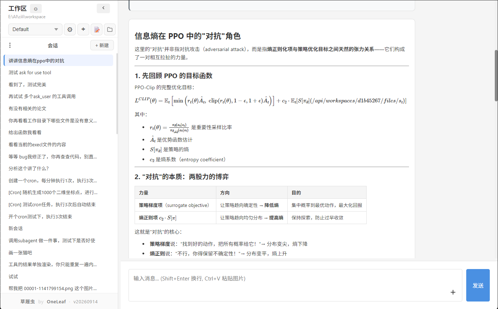

主界面分为左右两栏：

- **左侧**：会话列表，显示当前工作区的所有历史会话，支持新建会话
- **右侧**：聊天区域，Agent 的 Markdown + LaTeX 公式渲染输出

底部输入框支持：
- `Shift+Enter` 换行
- `Ctrl+V` 粘贴图片
- 点击 `+` 按钮上传文件

---

## 设置

点击顶部工具栏的 **齿轮图标** 打开设置对话框，包含四个标签页。

### Agent 模型

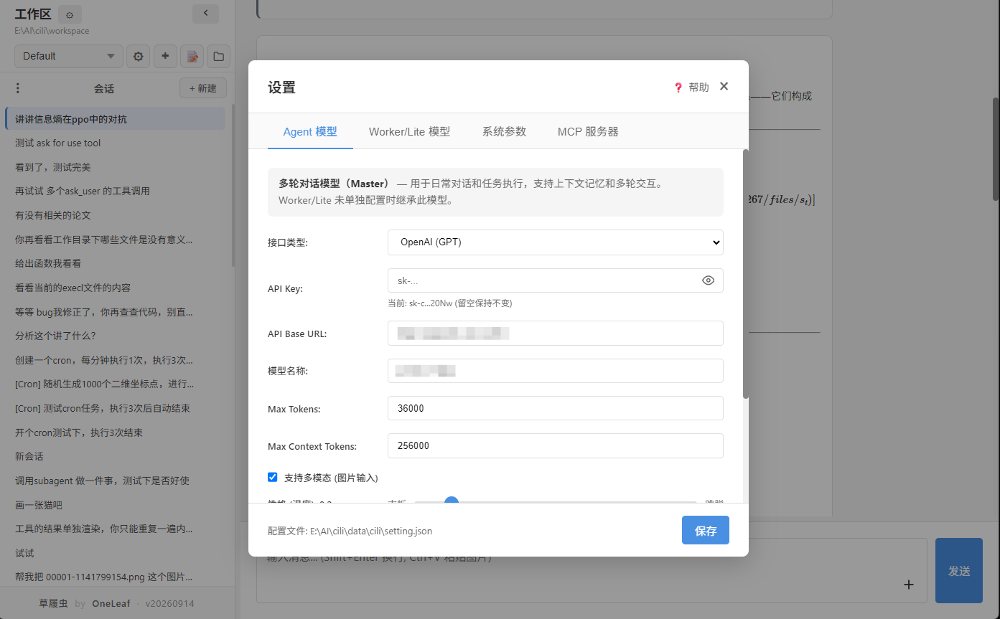

配置 Master 主对话模型（Worker/Lite 未单独配置时继承此模型）：

| 参数 | 说明 |
|------|------|
| 接口类型 | API 协议，支持 OpenAI / Anthropic 等 |
| API Key | 密钥，保存后再次编辑只显示前缀，留空保持不变 |
| API Base URL | API 端点地址 |
| 模型名称 | 模型 ID，如 `claude-sonnet-4-6` |
| Max Tokens | 单次输出最大 token 数 |
| Max Context Tokens | 上下文窗口大小 |
| 支持多模态 | 勾选后允许图片输入 |

### Worker/Lite 模型

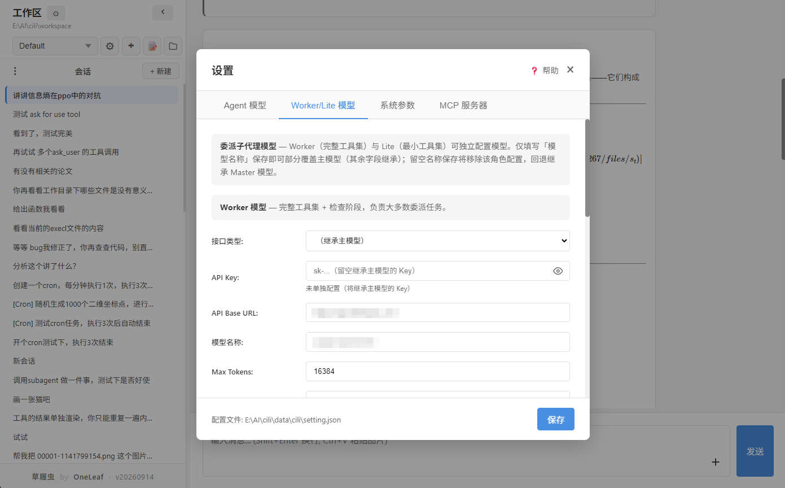

Worker（完整工具集）和 Lite（最小工具集）可独立配置模型。仅填写「模型名称」即可部分覆盖主模型（其余字段继承）；留空名称保存则将移除该角色配置，回退继承 Master 模型。

### 系统参数

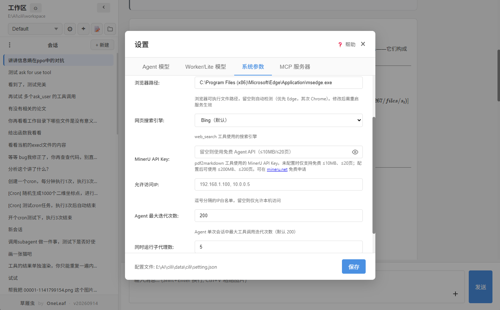

| 参数 | 说明 |
|------|------|
| 浏览器路径 | Chrome/Edge 可执行文件路径，留空自动检测 |
| 网页搜索引擎 | web_search 工具使用的搜索引擎（Bing / Google） |
| MinerU API Key | PDF 文档解析 API 密钥 |
| 允许访问 IP | 逗号分隔的 IP 白名单，留空仅允许本机访问 |
| Agent 最大迭代次数 | 单次会话中最大工具调用迭代次数（默认 200） |
| 同时运行子代数 | 并行子 Agent 数量上限 |

### MCP 服务器

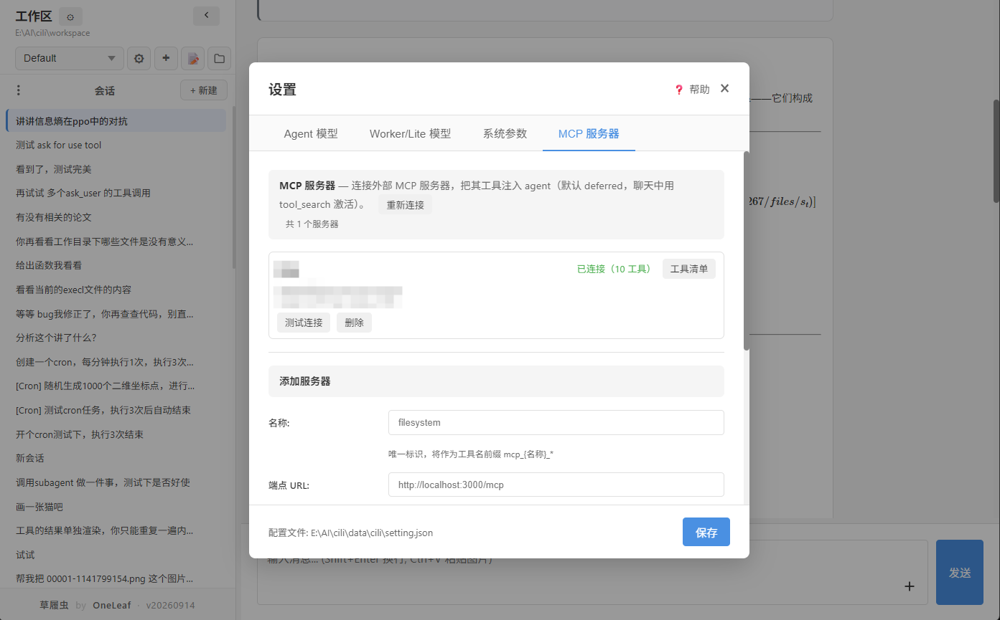

连接外部 MCP 服务器，把其工具注入 Agent（默认 deferred，聊天中用 `tool_search` 激活）：

- 已连接服务器显示工具数量，支持 **测试连接** / **删除** / **工具清单**
- **添加服务器**：填写名称（唯一标识，作为工具名前缀 `mcp_{名称}_*`）和端点 URL
- 支持 **重新连接** 所有已配置服务器

---

## 工作区

### 工作区设置

工作区设置对话框包含两个标签页：**基本设置** 和 **项目提示词**。

#### 基本设置

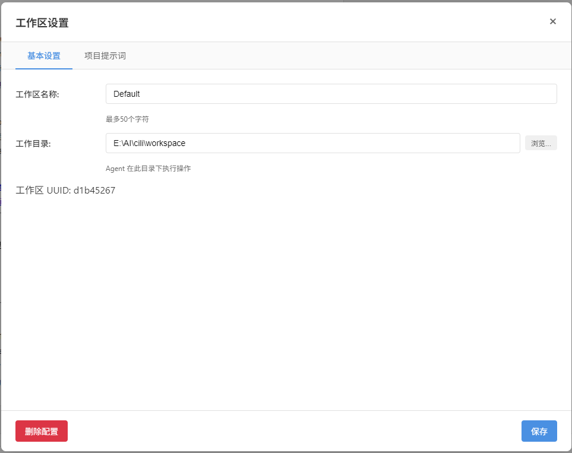

| 参数 | 说明 |
|------|------|
| 工作区名称 | 最多 50 个字符 |
| 工作目录 | Agent 在此目录下执行文件操作 |
| 工作区 UUID | 自动生成的唯一标识 |

支持 **删除配置** 和 **保存** 操作。顶部工具栏可切换工作区（下拉菜单）、管理多个工作区。

#### 项目提示词

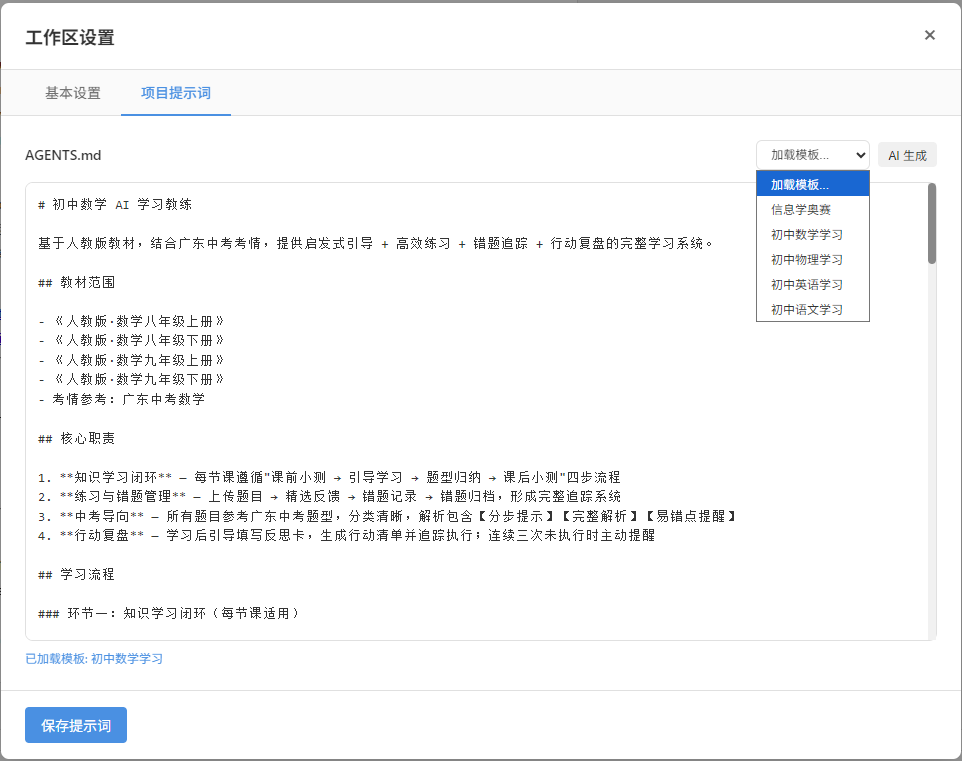

管理当前工作区的项目级指令文件（`AGENTS.md` 或 `CLAUDE.md`），AI 助手启动时会自动读取该文件以了解项目上下文：

- **文件编辑**：直接编辑项目提示词内容，保存时保持原文件名（编辑 AGENTS.md 就保存 AGENTS.md）
- **AI 生成**：点击「AI 生成」按钮，后台 Worker Agent 自动扫描项目代码结构，生成 `AGENTS.md`
- **加载模板**：从内置模板列表中选择一个模板快速初始化（如信息学奥赛、初中语文、初中英语等）

> 系统优先加载 `AGENTS.md`，若不存在则回退加载 `CLAUDE.md`。

### 文件管理

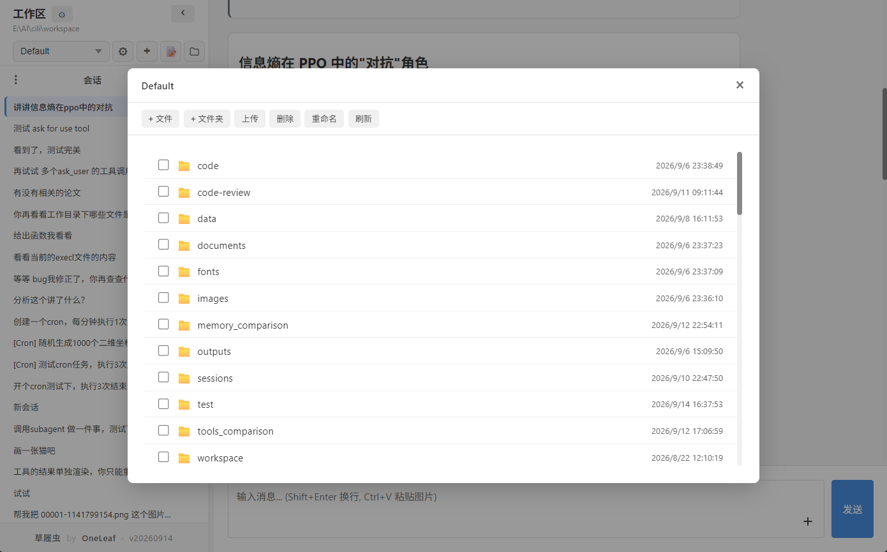

点击顶部工具栏的 **文件夹图标** 打开文件管理器，展示工作目录下的文件和文件夹列表，支持：

- **新建**：创建文件和文件夹
- **上传**：上传本地文件到工作区
- **删除 / 重命名**：文件操作
- **刷新**：重新加载目录列表

### 文件预览

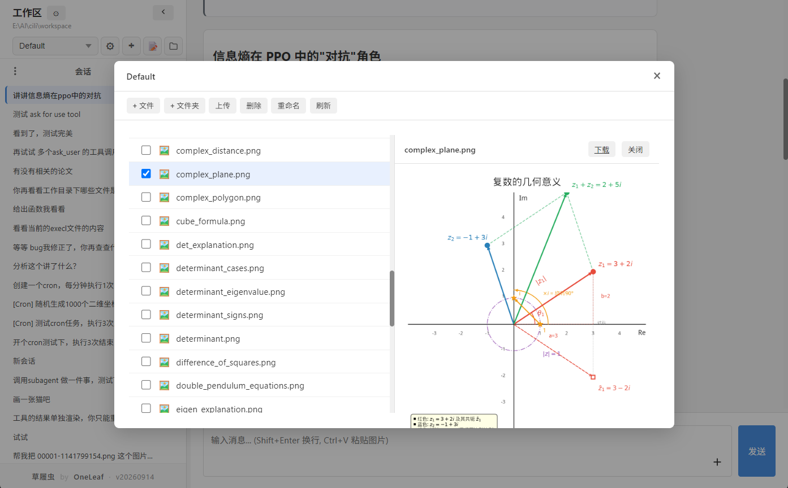

选中图片文件后，右侧预览面板展示图片内容，支持 **下载** 和 **关闭**。

---

## 学习模式

说一句「我想学习 XXX」即可触发学习引擎。Agent 会通过 ask_user 工具弹出问卷，确认两个关键信息：

**学习模式**（四种可选）：
1. **学习阶梯** — 从入门到精通分 5 级，建立完整学习路径
2. **20小时计划** — 找到核心 20% 内容，制定快速入门计划
3. **测验模式** — 先测出你现在的水平，找出知识边界的精确位置，再针对性学习
4. **费曼学习法** — 通过教别人来深度理解，讲解后你复述，Agent 找你的知识缺口

**当前水平**（初学/中级/高级/其他）：
- 帮助 Agent 判断起点，避免重复已掌握的内容

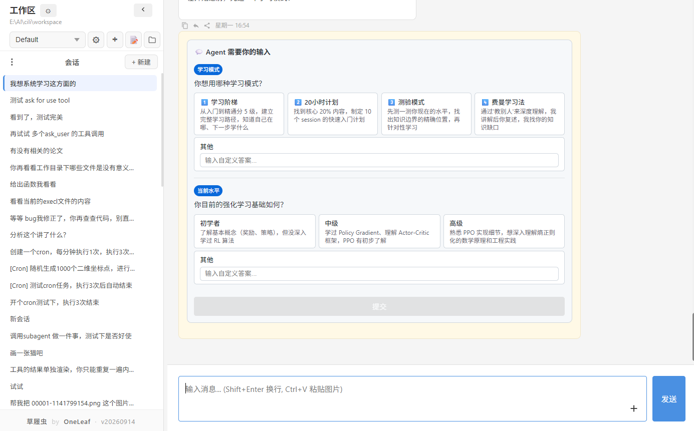

---

回答完成后，Agent 输出结构化的学习计划：

- **里程碑**：达到目标的能力标准描述
- **自检清单**：带勾选框的自测问题，帮助验证掌握程度
- **推荐资源**：精选论文、书籍、教程链接
- **当前位置**：Level 1-5 的进度标记（★ 当前级别）
- **建议的学习路径**：分步骤的下一步行动指南

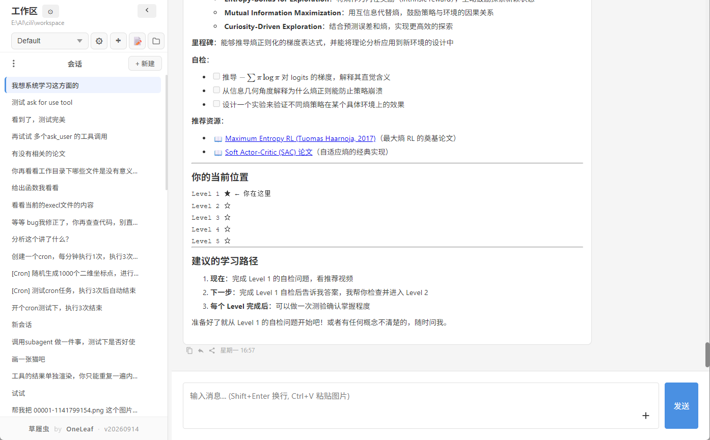

---

## 代码执行与可视化

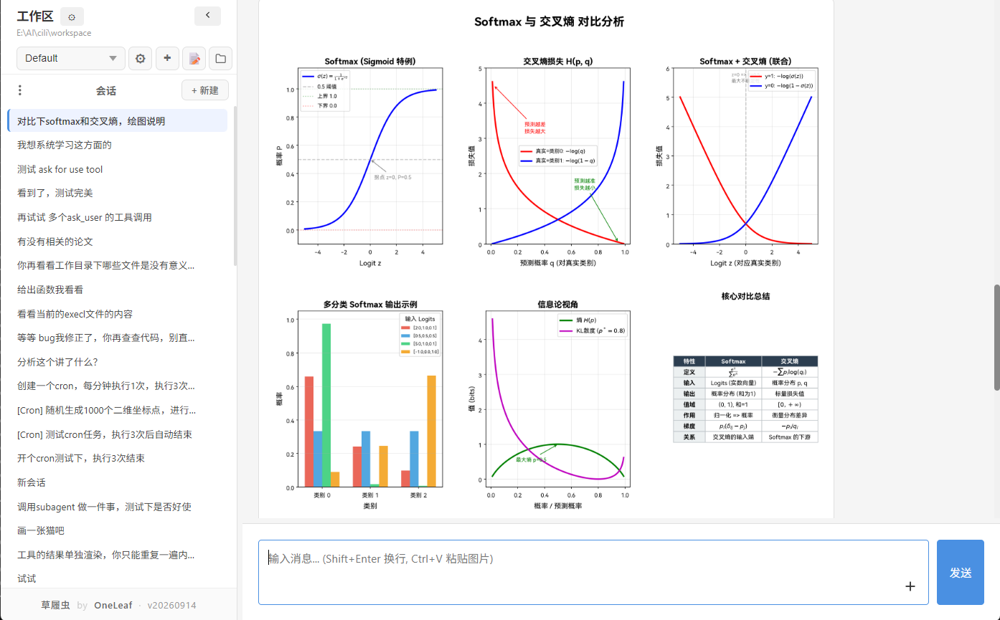

Agent 内置 Python 执行环境，可直接运行代码并渲染输出。上图为「对比下 softmax 和交叉熵，绘图说明」的输出，包含六个子图：

| 子图 | 内容 |
|------|------|
| Softmax (Sigmoid 特例) | Sigmoid 函数曲线，标注拐点 |
| 交叉熵损失 H(p, q) | 真实类别 0/1 两条损失曲线 |
| Softmax + 交叉熵 (联合) | 正确/错误类别的损失对比 |
| 多分类 Softmax 输出示例 | 柱状图展示不同 logits 的概率分布 |
| 信息论视角 | 熵 H(p) 与 KL 散度曲线 |
| 核心对比总结 | 表格对比 Softmax 与交叉熵的定义、输入、输出、值域等 |

支持的输出类型：
- **图表**：matplotlib / plotly 等库生成的图表自动渲染
- **数据表格**：结构化数据以 Markdown 表格展示
- **文本**：标准输出直接显示

---

## 记忆管理

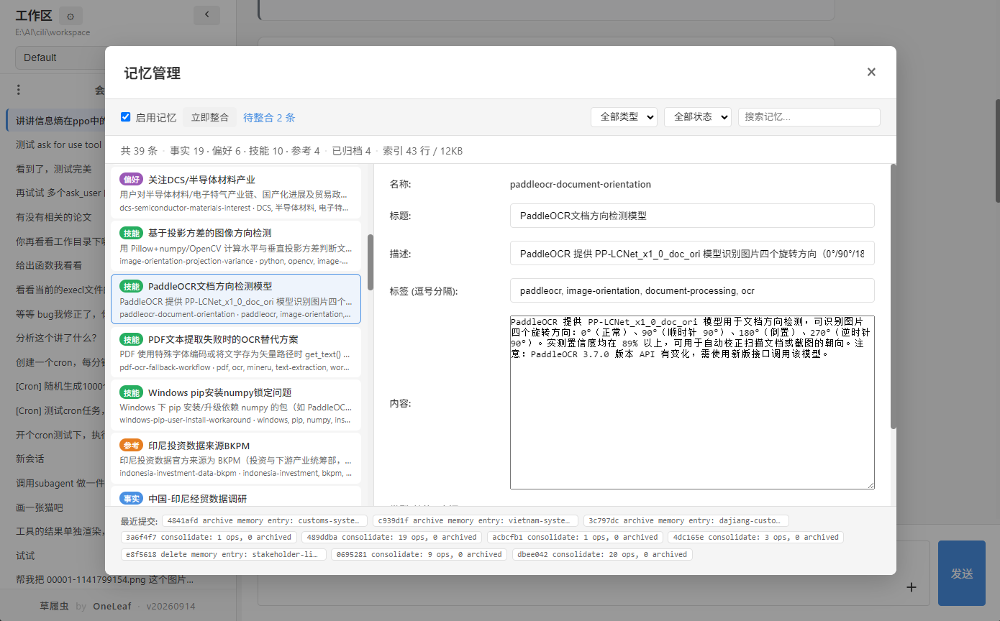

点击顶部工具栏的 **大脑图标** 打开记忆管理界面：

- **启用记忆**：全局开关，控制是否自动提取和注入记忆
- **立即整合**：手动触发记忆整合（journal → 条目）
- **待整合**：显示待整合的条目数量
- **统计概览**：总条目数、四类条目分布、索引行数

**四类记忆条目**：
- **偏好**（紫色）：用户的沟通风格和决策偏好
- **技能**（绿色）：可复用的操作经验和解决方案
- **参考**（橙色）：外部资源指针
- **事实**（灰色）：客观知识

右侧编辑面板支持修改条目的名称、标题、描述、标签和内容。底部显示 **最近提交记录**（整合、归档、删除等操作日志），支持按类型/状态筛选和关键词搜索。
